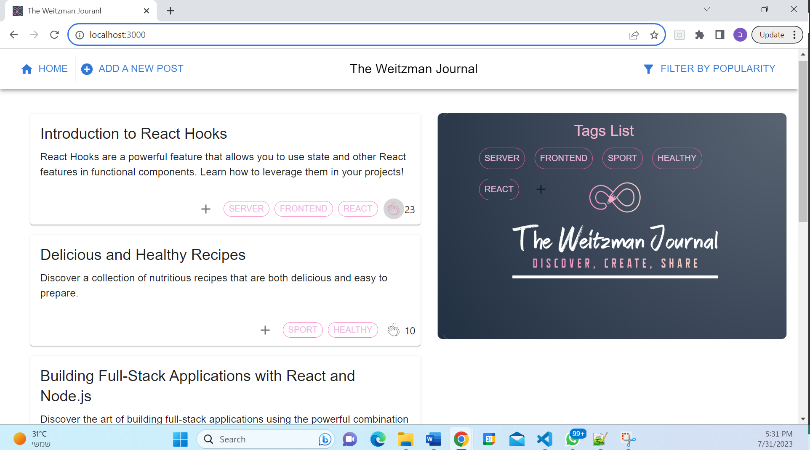

# The Weitzman Journal


## Table of Contents

- [Introduction](#introduction)
- [Features](#features)
- [Prerequisites](#prerequisites)
- [Installation](#installation)
- [Usage](#usage)
- [API Endpoints](#api-endpoints)
- [Technologies Used](#technologies-used)
- [Contributing](#contributing)
- [Future Possibilities and Improvements](#Future-Possibilities-and-Improvements-)

## Introduction

The Weitzman Journal is a full-stack blog application that allows users to read and create posts on various topics.
The project consists of both a client-side (React) and server-side (Node.js) implementation.



## Features

- View Posts: Users can view blog posts on various topics. Posts can be filtered based on popularity and tags.
- Create New Posts: Users can create new posts by providing a title, content, and selecting relevant tags. Each post can have multiple tags associated with it.
- Clap for Posts: Users can show appreciation for posts by clapping for them. However, a user is limited to a maximum of five claps per post.
- Tags Management: Tags play a crucial role in organizing posts. Users can view all available tags and create new tags for categorizing posts.
- (Add more features if applicable)

## Prerequisites

Before running this project, ensure you have the following installed:

- Node.js
- npm or yarn
- MongoDB

## Installation

1. Clone the repository to your local machine:
   ```bash
   git clone https://github.com/Benweitzman1/The-Weitzman-Journal.git
   ```
2. Change into the project directory:
   `cd The-Weitzman-Journal`

3. Install dependencies:
   `npm install`

## Usage

Start the application:
`npm start`

## API Endpoints

- GET /

  - Description: Welcome message.

- GET /user

  - Description: Get a unique user ID or set a new one using cookies.

- GET /posts

  - Description: Retrieve posts based on popularity and tags.

- GET /tags

  - Description: Retrieve all available tags.

- POST /tags/tagName/:tagName

  - Description: Create a new tag.

- POST /tags/:postId/:tagName

  - Description: Add a tag to a specific post.

- POST /posts/clap/:selectedPostId

  - Description: Clap for a post.

- POST /posts
  - Description: Create a new post.

## Technologies Used

Frontend: React, React Router, Material-UI, Axios
Backend: Node.js, Express.js, MongoDB
Others: CORS, Cookie-parser

## Contributing

Contributions are welcome! If you find any issues or have suggestions for improvements, feel free to open an issue or create a pull request.

## Future Possibilities and Improvements

1. User Authentication: Implement user authentication to allow users to create accounts and log in to access personalized features such as bookmarking favorite posts or creating drafts.
2. Commenting System: Add a commenting system to enable users to leave comments on posts and engage in discussions.
3. Search Functionality: Implement a search feature to allow users to search for posts based on keywords or topics.
4. Pagination: Add pagination to handle large numbers of posts and improve overall performance.
5. User Profiles: Create user profiles where users can view their own posts, claps, and activity.
6. Rich Text Editor: Enhance the post creation process by integrating a rich text editor for formatting posts.
7. Social Media Sharing: Allow users to share posts on social media platforms to increase the blog's reach.
